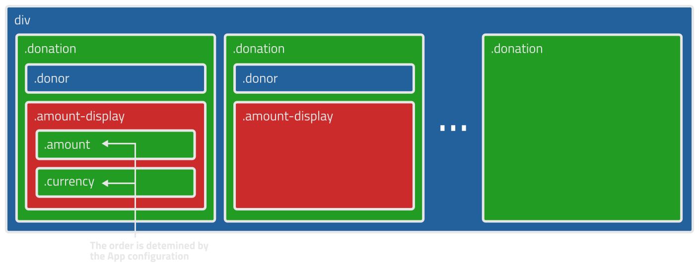

# Tiltify Overlay

Overlay made with React that shows a Tiltify campaign's donations, sorted by newest to oldest or by amount given descendingly. An article about the making of this application is provided [here.](https://dev.to/jmmedina00/writing-a-custom-overlay-with-react-5c3k)

## Usage instructions (as-is)

1. Get your campaign's id from the campaign's dashboard. This [article](https://info.tiltify.com/support/solutions/articles/43000011766-the-campaign-dashboard-an-in-depth-explanation) describes exactly where it is.

2. Go to the [account settings,](https://info.tiltify.com/support/solutions/articles/43000031909-my-account-settings) then go to _Your applications,_ create an application, enter its settings and get its access token from the section at the bottom.

3. Enter [here.](https://jmmedina00.github.io/tiltify-donors-overlay/)

4. Fill in the form with the campaign and the token, and select some options as you wish. When it's done, click _Generate link._

5. Go to OBS and add a browser source, paste the link that was copied to your clipboard and set up the dimensions as you prefer. Make sure to remove the default custom CSS and not mark _Shutdown source when not visible_ or _Refresh browser when scene becomes active._

## Styles documentation

You may modify the overlay's look via CSS, either by entering it in the `Custom CSS` field of the browser source's config, or by modifying them directly in the source code.

A `.donation` is composed of its `.donor` and `.amount-display`, the last one wrapping the elements with classes `.amount` and `.currency`, which might have the appearance order swapped in order to accomodate for both dollars ($5.99) and euros (5.99€), thus it's not recommended to alter the order of `.amount` or `.currency` if your styles are going to be run with different currencies.

If you wish to modify the styles without using the custom CSS textarea (eg. you wish to create your own styles), you'll have to run the application locally. Install [Node.js,](https://nodejs.org/) copy this repository and start the application by typing `npm start` at a command line set on the folder this repository has been copied to. The styles are located at `src/App.css`.
